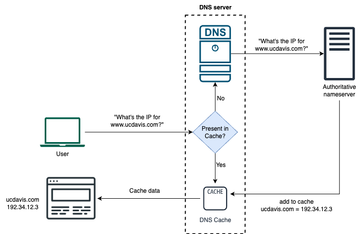
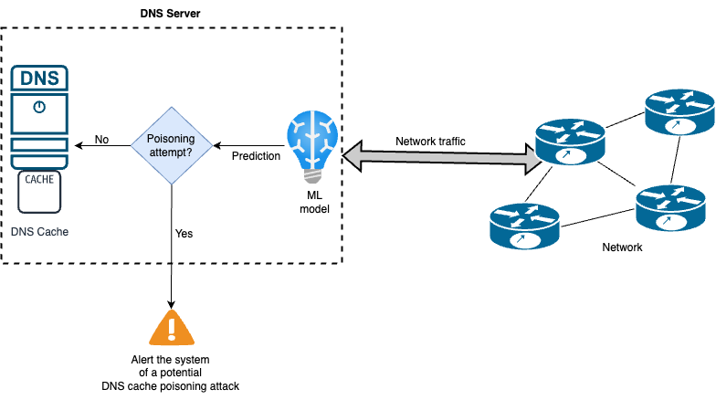

# ECS235A - Fall 2023 - InfoSec-project
# Developing a DNS Server in conjunction with a robust Machine Learning model to detect DNS Cache poisoning/spoofing attack

### Authors and Contributors
Arnib Quazi, Rohith Raj Srinivasan, and Srivatsan Srikanth

## Overview

The project is designed to provide a comprehensive solution to the persistent security concerns surrounding DNS infrastructure. Our primary objectives are twofold: first, to develop a robust DNS server that accurately translates human-readable domain names into machine-readable IP addresses, and second, to integrate a powerful machine learning model with this DNS server to enhance its ability to mitigate DNS cache poisoning and spoofing in real-time.

The DNS server component will be engineered with a focus on efficiency, speed, and compatibility with existing DNS protocols. This will ensure seamless integration into the existing internet infrastructure while maintaining a high level of performance. Concurrently, the machine learning model will be trained on diverse datasets encompassing normal DNS queries and anomalous patterns indicative of cache poisoning attempts.

The collaborative synergy between the DNS server and the machine learning model will empower the system to identify and respond to potential threats swiftly, providing a proactive defense mechanism against DNS cache poisoning/spoofing. By leveraging machine learning algorithms, the system will continually adapt and evolve, staying ahead of emerging threats and bolstering the overall security of the DNS ecosystem.

In essence, our project aims to pioneer a novel approach to DNS security, marrying traditional server functionality with cutting-edge machine-learning techniques. This amalgamation seeks to establish a robust defense against DNS cache poisoning and spoofing, contributing to the safeguarding of online communication and the preservation of digital security in an ever-evolving internet landscape.

## Methodology

## Results

The Random Forest model emerged as the top performer in our DNS cache poisoning attack detection system, achieving the highest overall accuracy of 90.01%. Its balanced precision, recall, and F1-score metrics for both classes highlight its effectiveness in classifying DNS cache vulnerability.

While Logistic Regression demonstrated competitive performance, the ensemble learning models, particularly XGBoost and Random Forest, showcased superior predictive capabilities. The results indicate the potential of these models for real-world applications, providing a robust defense against DNS cache poisoning threats.

In conclusion, our machine learning-based approach exhibits promise in proactively identifying DNS cache poisoning risks, with Random Forest emerging as a frontrunner among the evaluated models.

